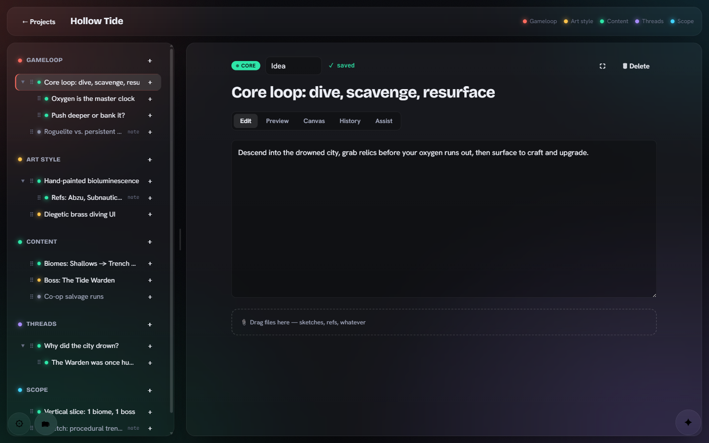

<div align="center">

# GameSketch

**Put your game ideas on paper as a living tree — local-first, AI-readable, no phone-home.**




&nbsp;
&nbsp;

</div>

## What it is

GameSketch is a local web app for turning a game idea into a structured, living **Game Design Document**. Every idea is a node in a tree, organised along customisable categories. Nodes are plain **Markdown files versioned with Git**. You can review changes, restore deleted ideas, export a readable document and back up complete projects.

It runs as **one Node process on your own machine**. No CDNs, no telemetry, no accounts in the cloud.

## The 5 pillars

Every project starts with these (you can rename / recolour / add / remove them per project):

1. **Gameloop** — how it's fun; the core loop
2. **Art style** — the look, with references
3. **Content** — where the journey goes; tagged `core` / `side` / `future`
4. **Threads** — detailed strands: story, crafting, causality (nest as deep as you like)
5. **Scope** — how far it all goes; asset budget

## Highlights

- 🌳 **Idea tree** — add / nest / reorder / duplicate subtrees, status `core·side·future`, alternatives & notes; remembered collapse state; Enter = sibling, Ctrl/Cmd+Enter = child when a tree row is focused
- ✍️ **Markdown editor** with live preview and autosave
- 🎨 **Doodle canvas** per node (Excalidraw, fully offline)
- 📎 **Attachments** — file picker or drag & drop, image thumbnails, remove a reference with undo
- 🕓 **Git history + one-click restore**, with an author on every change
- 🤖 **AI** — a read-API for external agents *and* an in-app copilot, pointed at a local endpoint, OpenRouter, or the local `claude` CLI
- 🌍 **English / Deutsch / Русский**
- 🔒 **No phone-home** — local fonts, no CDNs, no telemetry
- 🔎 **Search and links** — title/body search, progress and priority filters, `[[id]]` links with completion and backlinks
- ↩ **Trash and undo** — recover complete subtrees; undo structural and Copilot actions without overwriting newer work
- 📖 **Full document** — contents, drawings and attachments; standalone HTML with embedded local media, print/PDF, Markdown and JSON exports
- 🧩 **Starting points** — filled mechanic, enemy and playtest templates, plus a linked example project
- 📁 **Project management** — rename, archive, duplicate, download/import a complete project backup

## Requirements

- **Node.js ≥ 20** (tested on 24)
- **git** on your `PATH` (each project is its own git repo → history, author, restore)

## Quick start

**Production (single process, recommended):**

```bash
npm install
npm run build      # builds the frontend into web/dist
npm start          # serves UI + API on http://127.0.0.1:4321
```

Other port: `PORT=8080 npm start`.

**Development (hot reload, two processes):**

```bash
npm run dev:server   # API on :4321
npm run dev:web      # Vite UI on :5173 (proxies /api -> :4321)
```

On first launch you pick a **language** and create an account (`user:password` — no roles, it just stamps an author on every change, so the app is team-ready without extra complexity). Everything is later adjustable via the **gear (bottom-left)**: language, password, AI provider, agents, and a How-To.

## Where your data lives

Everything sits under **`data/`** (git-ignored by the app repo):

```
data/
  config.json              # users + AI provider settings
  projects/<slug>/         # each project is its own git repo
    project.md             # project meta + categories
    nodes/<category>/*.md  # each node = Markdown + frontmatter
    canvases/*.excalidraw  # doodles (JSON)
    assets/                # uploaded files
    trash/*.json           # deleted subtrees, including metadata and text
    actions/*.json         # undo records
  proposals/<slug>/*.json   # pending Copilot proposals
```

Use **Download backup** in the project header to save a `.gamesketch` file. **Open backup** on the projects page imports it as a **new project**, leaving the source untouched. The file includes text, attachments, drawings, trash, undo records and the project's Git history. It does not include user accounts, provider keys or browser conversations. The current file format supports 100 MiB compressed / 200 MiB unpacked, including history.

For a whole installation or larger projects, stop the server and copy `data/` (keep that copy private: `config.json` contains credentials). Browser conversations and unsaved text drafts live in local browser storage, scoped by user and project; they are not part of a project backup.

Deleting an idea moves it and its descendants to **Trash**. **Actions** lists the latest 50 structural/Copilot actions with undo; undo refuses when newer edits or dependencies would be lost. Restoring an earlier text version is available under node → **History** → Restore.
Restore brings back the title, text, idea type and statuses, including revisions from before a category move.
The current tree placement, attachments and canvas stay attached to the node.

## AI

Open the **gear → AI** and pick a provider (no `config.json` editing needed):

- **Local endpoint** — any OpenAI-compatible server (LM Studio, Ollama, …). Stays fully offline.
- **OpenRouter / API key** — `baseUrl` + `apiKey` + `model`; a **Load models** button pulls the list.
- **Claude CLI** — calls your local `claude` binary, no API key.

The node **Assist** tab offers *Find gaps*, *Summarise* and *Suggest alternative*. The **copilot** (✦) keeps a separate conversation for each project and user. Both interactive editing flows show a before/after preview. Changes are applied together after approval and can be undone as one action. Repeating an apply request does not duplicate ideas. Proposals made against older content must be regenerated.

Copilot context is a project overview with excerpts, currently capped at 12,000 characters: the open idea is prioritised; other bodies are shortened to 400 characters. The chat displays how many ideas were included. It does not inspect drawing pixels or attachment contents.

## Everyday shortcuts and exports

- **Ctrl/Cmd+K** focuses project search. Enter opens the first result; Escape clears filters.
- **Ctrl/Cmd+S** flushes pending text and drawing saves. Normal editing saves automatically.
- Type **`[[`** in the text editor and select an idea by title. `[[id|custom label]]` is also supported. Renaming an idea updates the default link label; the destination remains stable.
- Tree rows support left/right to collapse/expand. Move up/down and **Move** in the editor provide a keyboard-accessible alternative to dragging.
- **Full document → HTML with images** produces a standalone document with local attachments and drawings embedded. External Markdown image URLs remain external. **Print / PDF** prints the same complete document. Markdown and JSON are text/data exports; use the backup for restoration.
- Failed saves keep a local text draft. Reloading offers to recover it; switching away waits for pending saves to succeed.

## AI read-API (for external agents)

An external agent (e.g. the Claude Code CLI) can pull a whole design out and reason over it. Agents **pair** with the app to get a token (gear → **Agents** → Accept), then call the read endpoints:

```
GET /api/projects/:slug/export.json            # full nested tree
GET /api/projects/:slug/export.md              # whole GDD flattened to Markdown
GET /api/projects/:slug/nodes/:id/subtree.json # any subtree
GET /api/projects/:slug/nodes/:id/subtree.md
```

Full guide (pairing, tokens, read-only vs. read+write, a `claude` example): **[HOWTO.md](HOWTO.md)**.

## "Phones home to nowhere"

No CDNs, no Google Fonts (fonts are bundled locally via fontsource), no telemetry, no auto-update pings. Excalidraw runs fully offline. The app itself talks to no one.

**The one exception is AI:** the *assist* / *copilot* feature talks to the provider **you** select in the gear. A purely local endpoint (LM Studio / Ollama) stays offline; choosing a cloud provider (OpenRouter) or `claude -p` sends that design excerpt to that provider. You decide, per provider. The server only binds `127.0.0.1` — reachable from your machine only.

## Tests

```bash
npm test     # storage, auth, API, AI export and autosave regression tests
npx playwright install chromium   # once, for the browser tests
npm run test:e2e                  # production build + browser regression tests
```

Browser tests start their own server on `127.0.0.1:4339` with a new temporary data directory.
They use a deterministic local AI provider and never call paid/cloud models or use your `data/`. To use an installed Microsoft Edge on Windows instead of downloading
Chromium, set `$env:GS_BROWSER_CHANNEL = "msedge"` in PowerShell before running `npm run test:e2e`.

The `overrides` in `package.json` update pinned Nano ID / lodash-es dependencies used by the canvas
and its diagram parser. Keep them until upstream dependencies include the patched releases.

## Tech

Node + Fastify 5 · Markdown (gray-matter) + Git · React + Vite · Excalidraw · @dnd-kit · motion · fontsource (Bricolage Grotesque / Hanken Grotesk / JetBrains Mono). No Docker. One process. All local.

## License

[MIT](LICENSE) © 2026 ms
